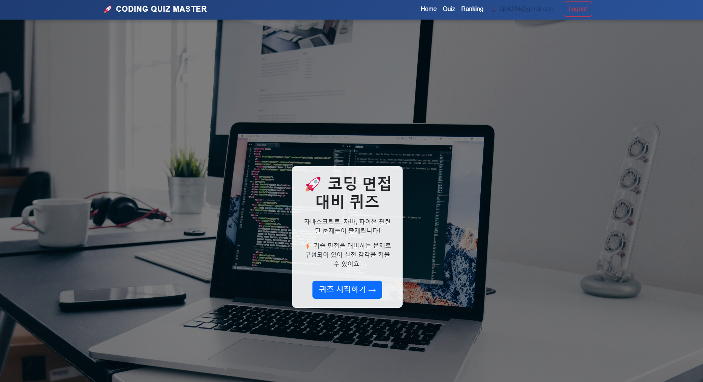
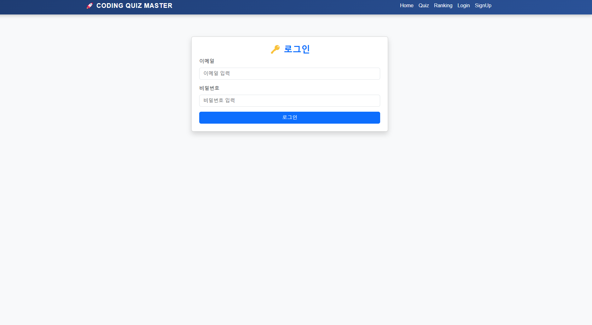
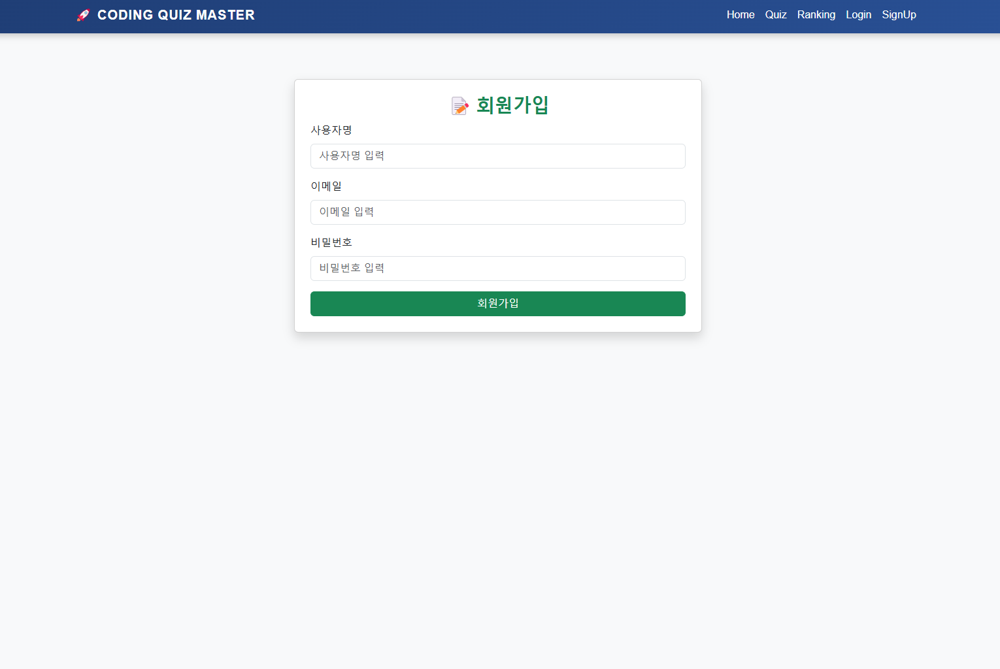
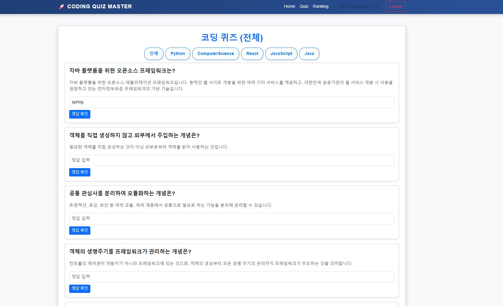
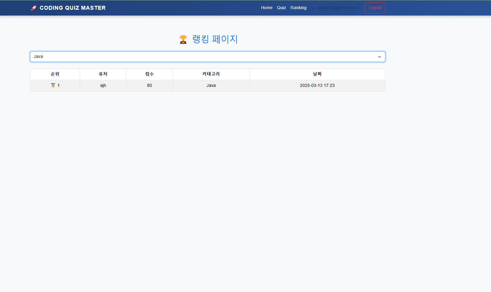
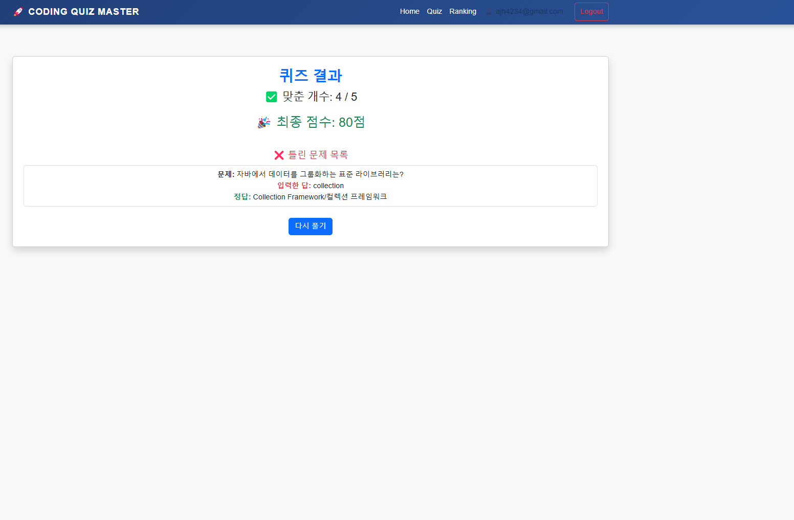

# 📌 Coding Quiz Project

## 📢 프로젝트 개요
- Coding Quiz Project는 FastAPI 기반의 백엔드와 Next.js 기반의 프론트엔드로 구성된 코딩 퀴즈 플랫폼입니다. 
- 사용자는 회원가입 및 로그인 후 퀴즈를 풀고 점수를 확인할 수 있으며, JWT 인증을 활용하여 보안을 강화하였습니다.

- 이 프로젝트는 AWS EC2, RDS를 활용하여 백엔드와 프론트엔드를 분리 배포하는 구조로 설계되었습니다.

---

## 📆 개발 기간
🗓️ **2025년 2월 28일 ~ 2025년 3월 14일 (약 2주 )**  

---

## 🚀 기술 스택

### 📌 백엔드 (FastAPI)
- **언어:** Python 3.10+
- **웹 프레임워크:** FastAPI
- **서버:** Uvicorn
- **DB:** PostgreSQL (RDS 사용) + SQLAlchemy
- **인증:** JWT (PyJWT)
- **환경 변수 관리:** dotenv
- **배포:** Docker, AWS EC2, RDS
- **기타:** CORS 설정, API 라우팅, CSV 데이터 관리

### 📌 프론트엔드 (Next.js)
- **언어:** JavaScript (ES6+)
- **프레임워크:** Next.js 15+
- **UI 라이브러리:** Bootstrap, CSS
- **상태관리:** React Context API
- **API 통신:** Fetch API, Axios
- **배포:** PM2, AWS EC2
- **기타:** ESLint, 환경 변수 관리

### 📌 개발 환경
- **운영 체제:** Ubuntu (EC2), Windows (로컬 개발)
- **패키지 매니저:** npm / yarn / pip
- **가상 환경:** venv
- **버전 관리:** Git & GitHub
- **컨테이너 관리:** Docker + PM2

---

## 🛠 주요 기능

### **1️⃣ 회원가입 & 로그인**
✅ **JWT 기반 인증 시스템 (Access Token 사용)**  
✅ **이메일/비밀번호를 통한 회원가입 및 로그인**  
✅ **자동 로그인 (LocalStorage 활용)**  
✅ **보안 강화를 위한 해싱된 비밀번호 저장 (bcrypt)**  
✅ **중복 가입 방지 (이메일, 사용자명 중복 체크)**  
✅ **로그인된 사용자만 접근 가능하도록 보호된 페이지 구현**  
✅ **로그아웃 (프론트에서 토큰 삭제)**  

### **2️⃣ 퀴즈 기능**
✅ **퀴즈 목록 불러오기 (카테고리별 퀴즈 제공 가능)**  
✅ **사용자가 정답을 선택하고 결과를 즉시 확인 가능**  
✅ **퀴즈 진행 상황 관리 (useReducer 활용)**  
✅ **점수 계산 및 자동 저장 (정답률 기반)**  
✅ **랭킹 시스템 구현 (카테고리별 상위 점수 순 정렬)**
✅ **CSV 기반 퀴즈 데이터 관리 및 자동 감지**
✅ **JWT 인증을 활용한 보호된 API 구현**

### **3️⃣ API 연동**
✅ **FastAPI 기반 REST API**
- FastAPI를 활용하여 고성능의 RESTful API 설계
- auth, quiz, ranking 등 도메인별 API 엔드포인트 구성
- uvicorn을 사용한 비동기 서버 운영

✅ **JWT 인증 및 보안 강화**
- OAuth2PasswordBearer를 활용한 보안 강화
- 로그인한 사용자만 접근 가능한 보호된 API 엔드포인트 제공
- /auth/verify-token API를 통한 토큰 유효성 검증 기능 추가
- /auth/logout 로그아웃 시 JWT 토큰 삭제

✅ **퀴즈 데이터 동적 관리**
- csv_listener.py를 활용하여 CSV 파일 변경 감지 및 자동 업데이트
- DB가 비어 있을 경우 CSV 데이터를 자동 로드
- PostgreSQL & SQLite 지원 (환경 변수 기반 설정)

✅ **카테고리 기반 퀴즈 필터링**
- /quiz/get API를 통해 랜덤 퀴즈 로드 및 카테고리 필터 적용 가능
- /quiz/categories API를 통해 사용 가능한 카테고리 조회 가능

✅ **점수 저장 및 랭킹 조회**
- /quiz/submit API를 활용하여 사용자 점수 저장 (덮어쓰기 방식 지원)
- /ranking/get API를 통해 카테고리별 TOP 10 랭킹 조회

---

## 🌍 배포 개요
### **배포 주소:** [Coding Quiz Project](http://44.203.184.203:3000/) 
#### 이 프로젝트는 AWS 환경에서 백엔드와 프론트엔드를 분리 배포하는 구조로 운영됩니다.

- 백엔드 (FastAPI)
  - EC2 (Ubuntu) + Docker + PostgreSQL (RDS)
  - JWT 인증 및 API 보호
  - CORS 문제 해결 적용
  - .env 환경 변수 기반 설정
  
- 프론트엔드 (Next.js)
  - EC2 (Ubuntu) + PM2
  - NEXT_PUBLIC_API_URL을 통한 환경변수 설정
  - pm2 restart --update-env 명령어 적용하여 환경변수 반영

---

## 📦 프로젝트 폴더 구조

```
📦 CodingQuizProject
├── 📂 backend
│   ├── 📂 app
│   │   ├── 📂 core
│   │   │   ├── config.py
│   │   │   ├── database.py
│   │   │   ├── security.py
│   │   │   ├── csv_listener.py
│   │   ├── 📂 models
│   │   │   ├── user.py
│   │   │   ├── quiz.py
│   │   │   ├── score.py
│   │   ├── 📂 routes
│   │   │   ├── auth.py
│   │   │   ├── quiz.py
│   │   │   ├── ranking.py
│   ├── Dockerfile
│   ├── main.py
│   ├── requirements.txt
│   ├── .env
│
├── 📂 frontend
│   ├── 📂 api
│   │   ├── auth.js
│   │   ├── quiz.js
│   │   ├── ranking.js
│   ├── 📂 app
│   │   ├── 📂 login
│   │   ├── 📂 signup
│   │   ├── 📂 quiz
│   │   ├── 📂 result
│   ├── 📂 components
│   │   ├── navbar.js
│   │   ├── quizcard.js
│   ├── 📂 context
│   │   ├── AlertContext.js
│   ├── next.config.mjs
│   ├── package.json
│   ├── .env.local
│   ├── README.md
```

---

## 🚀 로컬 실행 방법

### **1️⃣ 백엔드 실행**
```bash
# 백엔드 폴더 이동
cd backend

# 가상환경 활성화 (Windows)
venv\Scripts\activate

# 가상환경 활성화 (Linux/Mac)
source venv/bin/activate

# 패키지 설치
pip install -r requirements.txt

# 서버 실행
uvicorn main:app --reload
```

### **2️⃣ 프론트엔드 실행**
```bash
# 프론트엔드 폴더 이동
cd frontend

# 패키지 설치
npm install

# 개발 서버 실행
npm run dev
```

---

## 📸 프로젝트 미리보기 

### **메인 페이지**
- NavBar 구현 (로그인에 따른 동적 구현)


### **로그인 페이지**
- 이메일 & 비밀번호 입력 후 로그인  
- JWT 인증을 통한 자동 로그인 기능 지원  


### **회원가입 페이지**
- 사용자명, 이메일, 비밀번호 입력 후 회원가입  
- 이메일, 사용자명 중복 확인 로직 포함  


### **퀴즈 페이지**
- 카테고리 선택 후 문제 풀기  
- 정답 입력 후 확인 가능  
- 정답 맞출 경우 ✅, 오답 시 ❌ 표시  


### **랭킹 페이지**
- 카테고리별 TOP 10 랭킹 확인 가능  
- 사용자의 퀴즈 점수 저장 및 갱신  


### **결과 페이지**
- 사용자의 정답 개수, 정답률 표시  
- 오답 내역 확인 기능  


---

## 📜 개발 로그 & 문서 정리
- 이번 프로젝트에서는 개발 및 배포 과정에서 발생한 문제 해결 과정을 상세히 기록하였습니다. 
- 자세한 내용은 [개발 문서 링크](https://jelkov-developer.notion.site/2025-1a8c23f3073480ae933ff8e7073daa73?pvs=4)에서 확인할 수 있습니다.

---

## 💌 개발자 정보

### **👨‍💻 안제호 (JELKOV)**  
- **역할:** 풀스택 개발  
- **주요 작업:**  
  - **프론트엔드 전체 개발** (Next.js 기반 UI/UX 설계 및 기능 구현)  
  - **백업드 개발 (User, Ranking, Score 관련 API 및 수정)**  
  - **프론트엔드 AWS EC2 및 PM2 설정 및 배포**  
  - **CORS, 환경변수 (.env) 관리 및 최적화**  
- **GitHub:** [jelkov](https://github.com/JELKOV)  

---

### **👨‍💻 장준희 (jejuorangee)**  
- **역할:** 백엔드 개발  
- **주요 작업:**  
  - **FastAPI 기반 백업드 개발 (Quiz API 구현)**  
  - **CSV Listener 구현 및 데이터 자동 업데이트 시스템 개발**  
  - **백엔드 Docker 컨테이너화 및 AWS EC2 및 RDS 사용 배포**
- **GitHub:** [jejuorangee](https://github.com/jejuorangee)  

---
